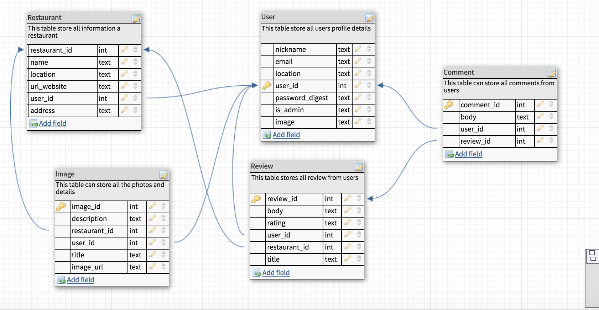

# README

This README would normally document whatever steps are necessary to get the
application up and running.

Things you may want to cover:

* Ruby version

* System dependencies

* Configuration

* Database creation

* Database initialization

* How to run the test suite

* Services (job queues, cache servers, search engines, etc.)

* Deployment instructions

*

Uncomment gem use for this prject:
# Use ActiveModel has_secure_password
gem 'bcrypt', '~> 3.1.7'

Add Gem file
#use for Heroku production server for live app
gem 'rails_12factor', group: :production
# use for debugger
gem 'pry-rails'
gem 'annotate'
gem 'jquery-rails'
gem 'ratyrate'  (https://github.com/wazery/ratyrate)

<!-- * [Play Boggle online](http://www.wordplays.com/boggle) -->

## Ideals for app
It is something every restaurant owner knows: good reviews boost takings while terrible ones can close you down. And, in an age when everyone can be an online critic, ratings have never been more important.
As Everyone's trying to do something to make themselves look better.
– although social media sites – they play an increasingly important role in how consumers judge the quality of goods and services."

## UserStory
[Restaurant Review App - ClickMe to read UserStory](https://trello.com/b/9eUKdeqU/restaurant-review-app)

## Model - Database

## Wireframes
[Restaurant Review ](http://127.0.0.1:32767/start.html#p=home&g=1)

## What I learn
I learned from this project to create Ruby on Rails with CRUD operation and upload images and create model on each object and use association relationship between each model like has_many or belongs_to.
Also this project, I apply API to get weather from location base on restaurant and geocoder to find the map of restaurant and near by these restaurants.

## What I can do betters

I wish if I have more time so I can make these apps look better for any user API weather from different location around the world. By the fault is is only Australia.

Also, I can design the apps look better by add more functionality to make app more useful. Such as display open restaurant hours..

# Gem
# - [bootstrap-sass](https://github.com/twbs/bootstrap-sass)
