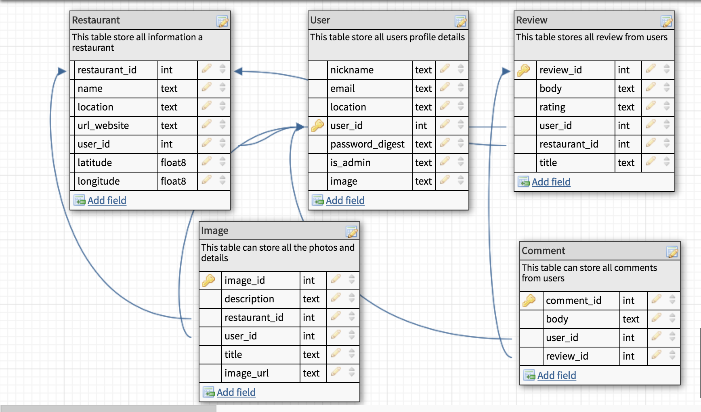

# Restaurant Review App - General Assembly Project 2

## Ideals for app

This app is something like social media sites where a customer can share their experience on the restaurant like they can post photo, comments and ratings.

## Access to app
[Live - Restaurant Review App](https://alexreviewrestaurant.herokuapp.com/)

## Build With
<ul>
  <li>Ruby on Rails</li>
  <li>Javascript</li>
  <li>HTML5</li>
  <li>CSS3</li>
  <li>Ajax</li>
  <li>API</li>
  <li>jQuery</li>
</ul>

## Gem Files
<ul>
  <li>has_secure_password: gem 'bcrypt', '~> 3.1.7'</li>
  <li>Heroku production server for live app: gem 'rails_12factor', group: :production</li>
  <li>use for debugger: gem 'pry-rails'</li>
  <li>use for annotate: gem 'annotate'</li>
  <li>jQuery for Ruby on Rails: gem 'jquery-rails'</li>
  <li>Ratings: gem 'ratyrate'</li>
  <lil>Bootstrap-sass: gem 'bootstrap-sass', '~> 3.3.7'</li>
  <li>Sass-rails: gem 'sass-rails', '>= 3.2'</li>
  <li>Google Map location: gem 'geocoder'</li>
  <li>API for weather: gem 'httparty'</li>
  <li>Upload Photo: gem 'cloudinary'</li>
</ul>

## UserStory
[Restaurant Review App -  UserStory](https://trello.com/b/9eUKdeqU/restaurant-review-app)

## Model - Database

## Wireframes
[Restaurant Review App - Wireframes ](https://1zs2wj.axshare.com)

## Libraries
<ul>
  <li>Bootstrap</li>
  <li>jQuery</li>
</ul>

## Contact
Alex Pham - alex.pham2010@gmail.com
